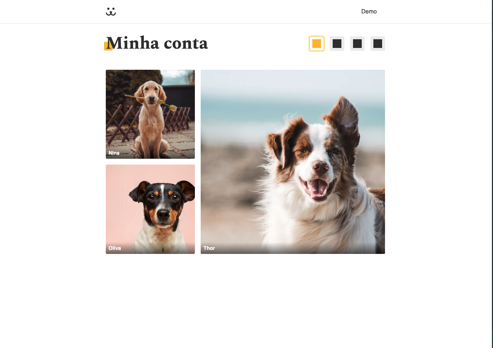

# Dogs

[](https://github.com/ArturRibeiro01/react-dogs/actions/workflows/ci.yml)

Dogs é uma rede social para cachorros, construída em React, onde usuários podem criar conta, entrar, publicar fotos, navegar pelo feed, abrir detalhes de uma foto e acompanhar estatísticas das próprias publicações.

O projeto nasceu como estudo do curso de React da Origamid e foi modernizado como um projeto de portfólio. A proposta atual é mostrar evolução técnica de uma base antiga para uma aplicação mais madura: TypeScript, Vite, React 19, rotas estáveis, estado global com Zustand, formulários tipados, testes, CI/CD, modo demo e documentação de decisões.

## Ambientes

| Ambiente        | URL                                                |
| --------------- | -------------------------------------------------- |
| Produção        | <https://arturribeiro01.github.io/react-dogs/>     |
| Dev/homologação | <https://arturribeiro01.github.io/react-dogs/dev/> |

Os dois ambientes são publicados pelo GitHub Pages. Produção fica na raiz do projeto e dev fica no subpath `/dev/`.

## Demo

O app pode rodar sem depender da API externa usando o modo demo/mock.

```txt
usuario: demo
senha: Demo1234
```

Para ativar localmente:

```bash
VITE_DEMO_MODE=true
```

Nesse modo, login, usuário, feed, upload, estatísticas e recuperação de senha usam dados mockados em memória. Quando `VITE_DEMO_MODE` está ausente ou `false`, o app usa a API pública da Origamid.

## Screenshot



## Funcionalidades

- Login, logout e validação automática do token salvo.
- Cadastro de usuário.
- Recuperação e redefinição de senha.
- Feed público com fotos.
- Feed da conta filtrado pelo usuário logado.
- Modal de detalhes da foto com fechamento por botão, clique fora e tecla Escape.
- Upload de foto autenticado.
- Tela de estatísticas com total, média e visualizações por foto.
- Estados de loading, erro, sucesso, vazio e falha de rede.
- Error Boundary para falhas inesperadas de renderização.
- Modo demo/mock para navegação independente da API externa.
- Deploy automatizado para dev e produção.

## Stack

- React `^19.2.6`
- React DOM `^19.2.6`
- React Router `6.30.2`
- TypeScript `^6.0.3`
- Vite `^6.4.2`
- Zustand
- React Hook Form
- Zod
- Emotion
- Vitest
- jsdom
- Testing Library
- ESLint
- Prettier
- Husky
- lint-staged
- GitHub Actions
- GitHub Pages
- Yarn Classic

## Destaques Técnicos

- Migração de Create React App para Vite.
- Migração gradual de JavaScript para TypeScript.
- Atualização para React 19 e React Router 6 estável.
- Cliente de API centralizado em `src/api.ts`.
- API configurável por ambiente com `VITE_API_URL`.
- Modo demo/mock em `src/mockApi.ts` para reduzir dependência da API externa.
- Estado global de autenticação migrado de Context API para Zustand.
- Formulários padronizados com React Hook Form e validação por Zod.
- CSS Modules removidos em favor de Emotion com arquivos `*.styles.ts`.
- Tema claro tipado em `src/styles/theme.ts`.
- Tokens globais expostos como CSS variables em `src/styles/GlobalStyles.tsx`.
- Testes automatizados para schemas, hooks, rotas protegidas, login, recuperação de senha, Header, Feed, menu da conta e Error Boundary.
- CI/CD com build, typecheck, lint, testes e deploy no GitHub Pages.
- Hooks locais de qualidade com Husky e lint-staged.

## Como Rodar

Requisitos:

- Node 20+
- Yarn 1.x

Instale as dependências:

```bash
yarn install
```

Crie um `.env.local` se quiser sobrescrever a configuração padrão:

```bash
cp .env.example .env.local
```

Rode em desenvolvimento:

```bash
yarn dev
```

Faça build de produção:

```bash
yarn build
```

Faça preview do build:

```bash
yarn preview
```

Observação: a integração com Supabase Auth usa `@supabase/supabase-js`, que exige Node 20+ nas versões atuais. Use Node 20 ou superior para instalar dependências e rodar os checks.

## Variáveis De Ambiente

```bash
VITE_API_URL=https://dogsapi.origamid.dev/json
VITE_DOGS_API_URL=http://localhost:3333
VITE_SUPABASE_URL=https://xvmhejphdmvanbqpdrxf.supabase.co
VITE_SUPABASE_ANON_KEY=sb_publishable_...
VITE_DEMO_MODE=false
```

| Variável                 | Descrição                                                   |
| ------------------------ | ----------------------------------------------------------- |
| `VITE_API_URL`           | URL base da API antiga ainda usada por fluxos não migrados. |
| `VITE_DOGS_API_URL`      | URL base da nova Dogs API.                                  |
| `VITE_SUPABASE_URL`      | URL pública do projeto Supabase usado no Auth.              |
| `VITE_SUPABASE_ANON_KEY` | Chave pública anon/publishable do Supabase.                 |
| `VITE_DEMO_MODE`         | Quando `true`, usa mocks locais em vez dos serviços reais.  |

No GitHub Actions, as mesmas variáveis podem ser separadas por ambiente:

```txt
VITE_API_URL_DEV
VITE_DOGS_API_URL_DEV
VITE_SUPABASE_URL_DEV
VITE_SUPABASE_ANON_KEY_DEV
VITE_DEMO_MODE_DEV

VITE_API_URL_PROD
VITE_DOGS_API_URL_PROD
VITE_SUPABASE_URL_PROD
VITE_SUPABASE_ANON_KEY_PROD
VITE_DEMO_MODE_PROD
```

Se as variáveis com sufixo não existirem, o workflow usa as variáveis sem sufixo como fallback. As chaves `VITE_` ficam públicas no bundle; não use service role key do Supabase no frontend.

Contrato atual da API:

```txt
docs/API.md
```

## Scripts

| Script              | O que faz                                              |
| ------------------- | ------------------------------------------------------ |
| `yarn dev`          | Sobe o Vite em modo desenvolvimento.                   |
| `yarn typecheck`    | Executa `tsc --noEmit`.                                |
| `yarn lint`         | Executa ESLint em todo o projeto.                      |
| `yarn lint:fix`     | Executa ESLint com correções automáticas.              |
| `yarn format`       | Formata o projeto com Prettier.                        |
| `yarn format:check` | Verifica se os arquivos seguem o padrão do Prettier.   |
| `yarn test`         | Executa a suíte automatizada com Vitest.               |
| `yarn test:watch`   | Executa Vitest em modo watch.                          |
| `yarn build`        | Executa typecheck e build de produção.                 |
| `yarn preview`      | Serve localmente o build gerado.                       |
| `yarn check:api`    | Valida se a Dogs API responde em `/health`.            |
| `yarn validate`     | Executa lint, format check, typecheck, testes e build. |

O Husky configura um `pre-commit` local que roda `lint-staged`, `typecheck` e `test` antes do commit.

## Estrutura

```txt
index.html
vite.config.ts
tsconfig.json
src/
  App.tsx
  index.tsx
  api.ts
  mockApi.ts
  types.ts
  schemas/
  stores/
  styles/
  Assets/
  Components/
    Feed/
    Forms/
    Header/
    Helper/
    Login/
    User/
  Hooks/
docs/
  API.md
  ARCHITECTURE.md
  BACKEND_API_PLAN.md
  CODEX_BACKEND_HANDOFF.md
  DOGS_API_SPEC.md
  DEPLOYMENT.md
  DEVELOPMENT.md
  PROJECT_STATUS.md
scripts/
  check-api-health.mjs
```

## Convenções

- Componentes React usam `.tsx`.
- Hooks, helpers e cliente de API usam `.ts`.
- Estado global de autenticação fica em `src/stores/authStore.ts`.
- Schemas de validação ficam em `src/schemas/`.
- Tema e tokens ficam em `src/styles/`.
- Componentes compartilhados ficam em pasta própria com `Component.tsx`, `Component.styles.ts` e `index.ts`.
- CSS global fica restrito a reset/base e utilitários em `App.css` e `GlobalStyles`.
- O acesso à API deve passar por `src/api.ts`.
- Tipos compartilhados ficam em `src/types.ts`.

## Fluxo De Branches

```txt
feature/* -> develop -> main
```

- `develop`: integração, homologação e deploy em `/react-dogs/dev/`.
- `main`: produção e deploy em `/react-dogs/`.

O GitHub Pages do repositório deve usar `GitHub Actions` como source.

## Qualidade

Checks principais:

```bash
yarn validate
```

Validações cobertas:

- ESLint sem warnings.
- Prettier check.
- TypeScript sem emissão.
- Testes automatizados com Vitest.
- Build de produção.

O CI roda esses checks em pull requests e publica no GitHub Pages quando há merge nas branches de ambiente.

## Decisões E Aprendizados

Este projeto foi tratado como uma modernização incremental, não como reescrita completa. A ideia foi preservar comportamento funcional enquanto partes antigas eram substituídas por escolhas mais sustentáveis.

Principais decisões:

- Manter o frontend neste repositório e planejar a API própria em outro projeto.
- Usar modo demo/mock para que o portfólio continue navegável mesmo se a API externa ficar instável.
- Centralizar contratos de API e tipos compartilhados para reduzir acoplamento.
- Trocar validações manuais por schemas Zod reaproveitáveis.
- Migrar estilos para Emotion com arquivos próprios de estilo por componente.
- Colocar qualidade automatizada no fluxo local e no GitHub Actions.

O resultado é uma base mais previsível para evoluir: ainda simples o bastante para ser entendida rápido, mas com fundações melhores para testes, manutenção, deploy e crescimento.

## Roadmap

- Criar uma API própria em repositório separado, sugerido como `dogs-api`.
- Persistir uploads e dados reais fora do modo demo.
- Adicionar mais capturas ou GIFs dos principais fluxos do app.
- Evoluir testes de integração para fluxos completos de usuário.
- Adicionar observabilidade simples para erros de runtime.
- Revisar acessibilidade com ferramentas automatizadas e navegação por teclado.

## Documentação

- `docs/API.md`: contrato da API pública usada hoje e recomendações para backend próprio.
- `docs/ARCHITECTURE.md`: estrutura atual, aliases e convenção de imports.
- `docs/BACKEND_API_PLAN.md`: decisão e plano para criar a API própria em outro repositório.
- `docs/CODEX_BACKEND_HANDOFF.md`: padrão de trabalho, CI, Husky, docs e prompt para iniciar o backend com Codex.
- `docs/DOGS_API_SPEC.md`: especificação de produto, domínio e contrato sugerido para o backend próprio.
- `docs/DEPLOYMENT.md`: esteira de CI/CD e GitHub Pages.
- `docs/DEVELOPMENT.md`: guia para retomar desenvolvimento.
- `docs/PROJECT_STATUS.md`: histórico e status da modernização.
- `docs/github-issues/README.md`: histórico do backlog local.
- `docs/github-issues/PRIORITY.md`: ordem usada durante a modernização.

## Observações

A API pública da Origamid é uma dependência externa. Para um portfólio mais robusto, a decisão registrada é criar uma API própria em outro repositório e manter o modo demo/mock como fallback.
